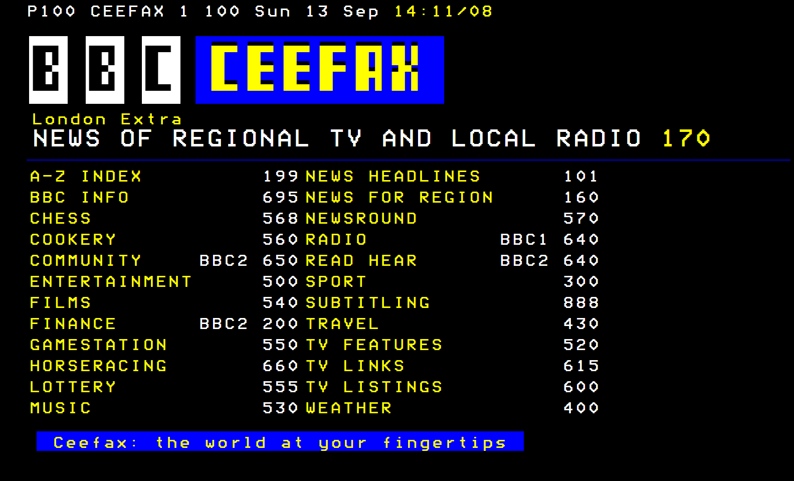
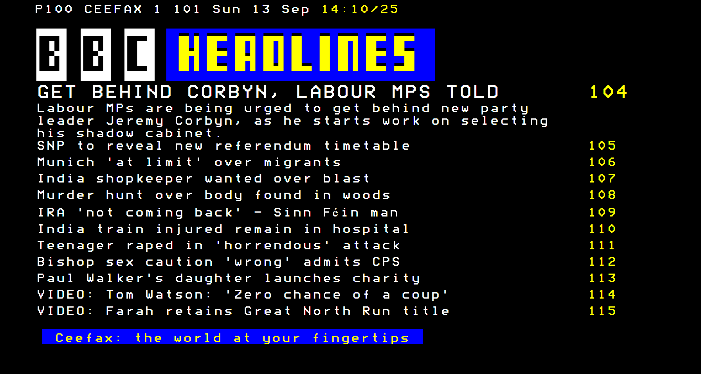
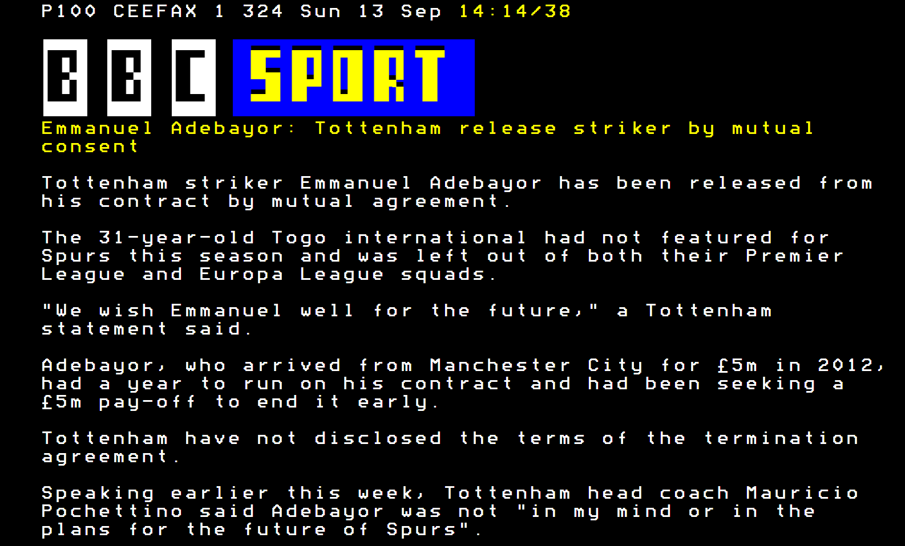

# Ceefax 2015
An interactive Ceefax app scraping stories from the BBC Website.

The "BBC" Logo and all content belong to the BBC, you must comply with their [terms](http://www.bbc.co.uk/terms/personal.shtml) to use this app.

### Requirements
* node.js
  * [Cheerio](https://github.com/cheeriojs/cheerio)
  * [Feedparser](https://github.com/danmactough/node-feedparser)

### Installation
* Modify [Node server to connect](clock.js#L163), default is http://localhost:8080
* ``` npm install cheerio ```
* ```npm install feedparser```
* ```node node/app.js```
* Copy web folder to public web server

### Current Index (Implemented Pages)
* 100 - Home
* 101 - Headlines
* 104-115 - Headline Stories
* 300 - Sports Home
* 301 - Sports Headlines
* 302 - Football
* 303-314 - Football Stories
* 320-331 - Sports Stories
* 340 - Cricket Headlines
* 341-352 - Cricket Stories
* 500 - Entertainment Headlines
* 501-512 Entertainment Stories

### Images





